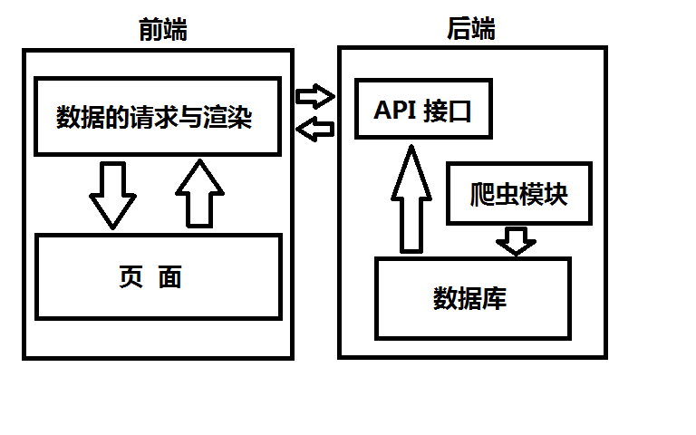

# OOSA
创新实践 － 基于海淘的前端设计与数据可视化

**项目架构图**



**技术说明**

数据库: mysql

爬虫模块: java

API: php

数据渲染: php / nodejs

页面呈现: html + css + js

## 第八周 (15.11.13)

* RESTful API

**1. 获取商品类别列表**
###### 接口功能
> 获取商品类别列表

###### URL
> /api/typelist.php

###### 支持格式
> JSON

###### HTTP请求方式
> GET

###### 请求参数
> null

###### 返回字段
> |返回字段|字段类型|说明                              |
|:-----   |:------|:-----------------------------   |
|status   |int    |0：正常；1：错误。   |
|id  |int | 类别编号                      |
|name |string |类别名称                         |

###### 接口示例
> 地址：/api/typelist.php
``` javascript
{
    "statue": 0,
    "type": [
      {
        "id": 1,
        "name": "奶粉"
      },
      {
        "id": 2,
        "name": "纸尿裤"
      }
    ]
}
```

* 综合文档

* 测试集建立

## 第七周 (15.11.08)

* 研究商品相似度（同种商品出现在不同的电商平台中，如何判断是完全相同商品）

* 针对奶粉建立数据模型，拟合不同电商平台上的奶粉产品

* 爬虫的代理访问

* 爬虫的模拟登录

## 第五、六周 (15.11.02)

**总体方向：做多网站产品比价平台 (海淘)**

前端:
* 首页界面的完善

* 数据图 + 动态表格 + 首页三者整合 "首页” -> "品牌页面" -> "产品页面 (含有比价)"

* 数据图的完善与补充 (增加价格的数据维度，比价数据展现的构想)

后端:
* 从天猫国际 - 奶粉开始，爬取奶粉比价需要的各个属性

* 根据比价需要的属性完善数据库设计

* 完成多平台—奶粉数据的爬取工作

* 配合前端数据可视化需要，实现一定程度的与前端交互

## 第四周 (15.10.19)

**数据源**

天猫国际板块 - 母婴用品 - 奶粉商品

**提取数据特征**

奶粉品牌与其对应的销量

**分析与呈现**
* 品牌销量比重 = 该品牌销量 / 总销量

* 销量增长值 = 当前销量 - 上一次采集销量

根据销量比重绘制柱状图，向用户推荐奶粉品牌

根据销售增长量绘制动态表隔，呈现近期奶粉品牌的销量增长趋势

**需要做的工作有**

* 天猫国际奶粉商品相应品牌与销量的数据采集

* 采集数据的存储

* 销量数据图、数据表的绘制

* 呈现页面的设计与美化
